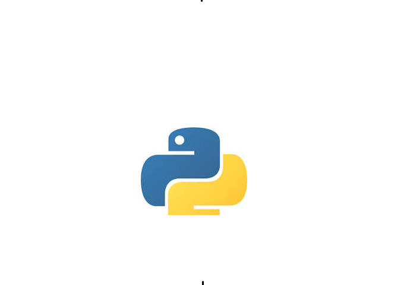

Repositorio apenas para aprender a melhorar commits e aprender Markdown.

# E-commerce empresa x

Vamos criar um **e-commerce** para a *empresa x* e etc.

## Funcionalidades:

_Checkout, **Tela de produto**, Catálogo e Home com Banner._

**Projeto para _aplicação de vendas_ do cliente na web.**

### Melhorias no projeto:

__Melhoria 1__, _Melhoria 2_ e Melhoria 3.

### Linguagens do projeto:

* HTML
* CSS
* Javascript
* PHP
* MySQL

### Funcionalidades a desenvolver:

1. Área de Membros
   1. Login para clientes especiais
   2. Desconto especial para clientes
   3. CSS diferente para cada cliente
2. Integração com outros pagamentos
3. Sistema de bônus primeira compra

### Imagem Local

### Imagem Externa 

### Iamgem de Dashboard 

